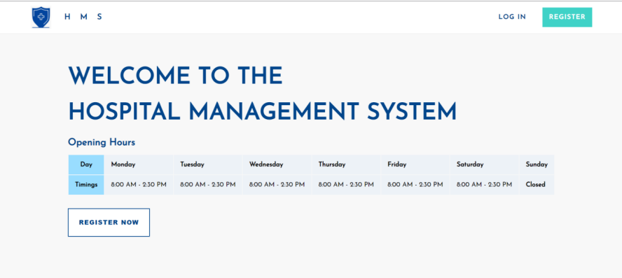
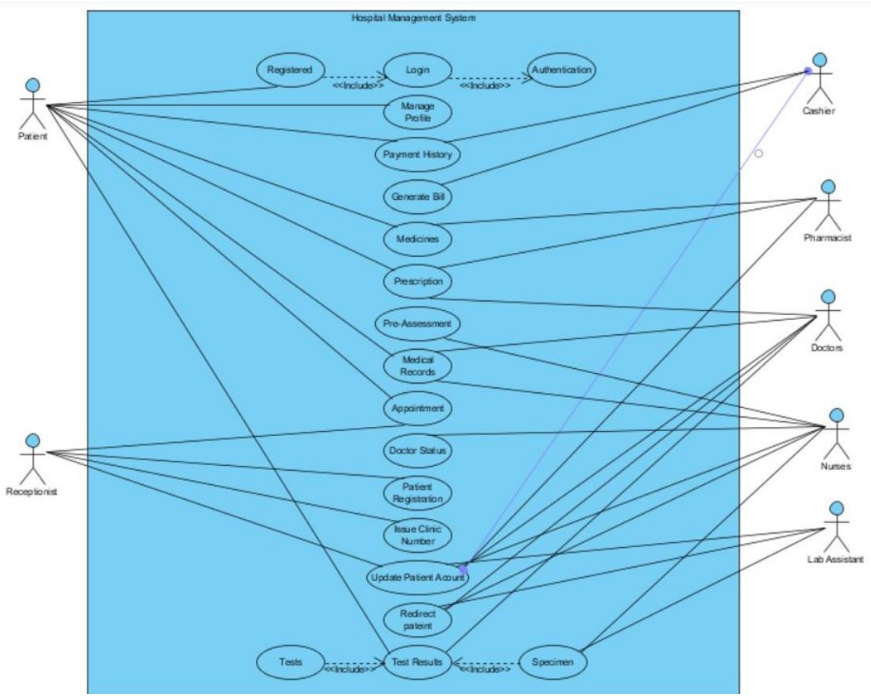
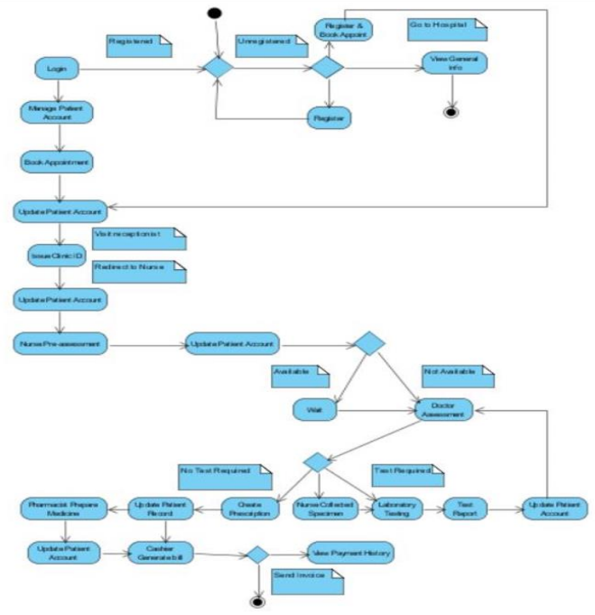
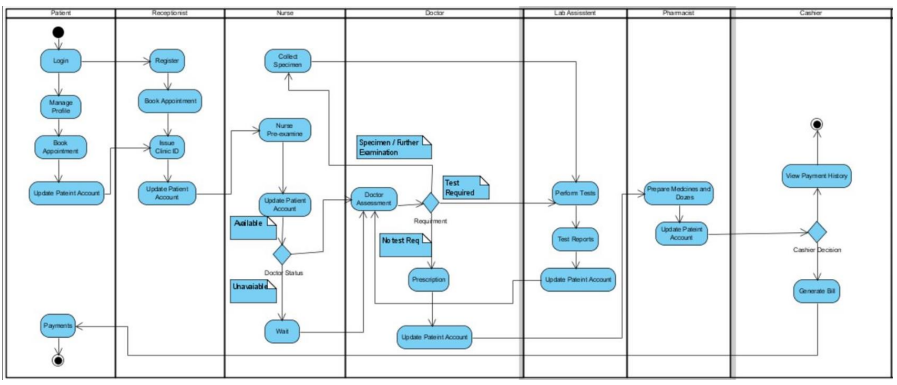
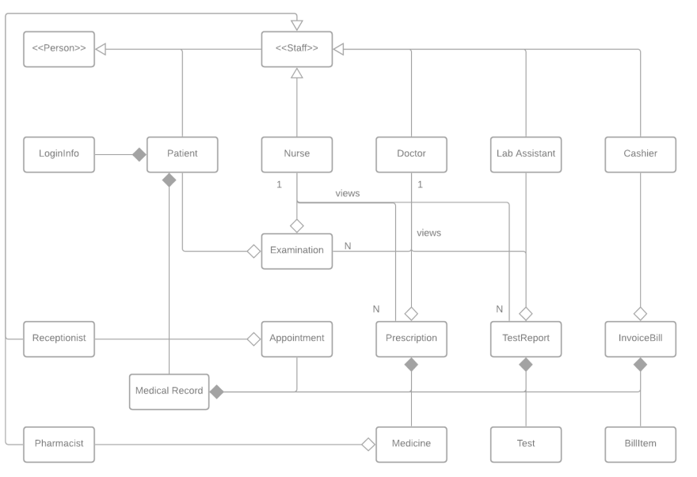
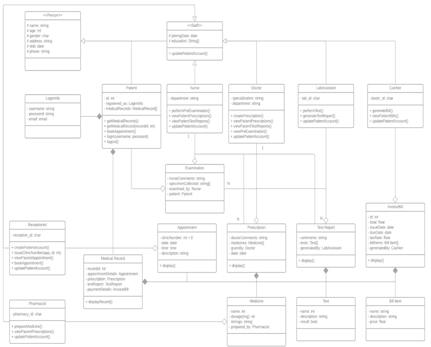
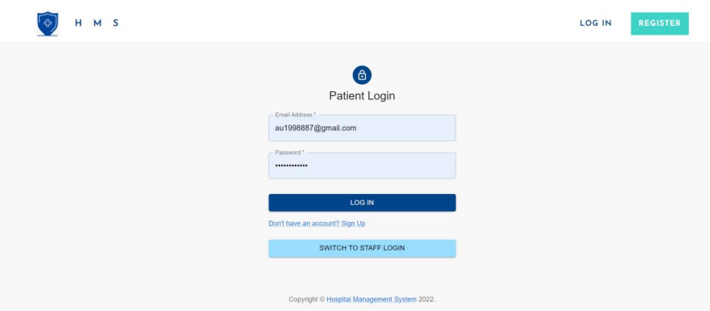
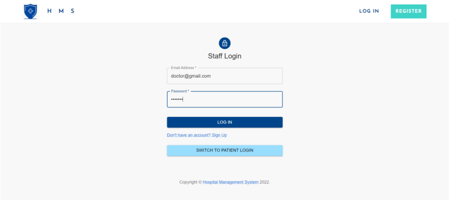
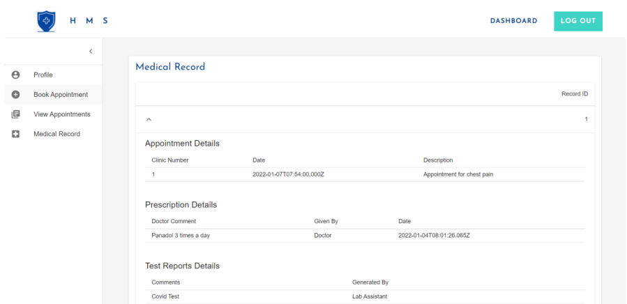
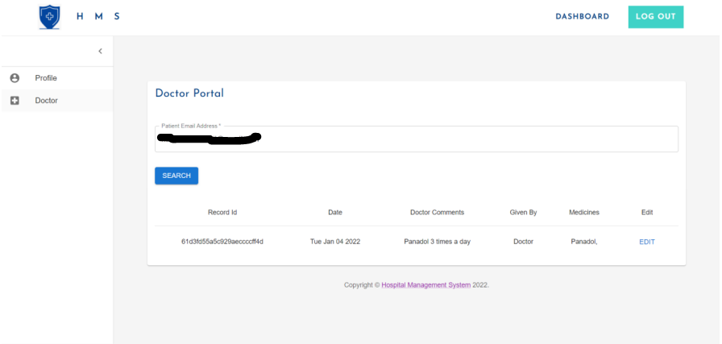

# Hospital Management System.

Hospital Management System having available portals for patients and different roles of staff. Built using MongoDB, Express.js, React.js and Node.js.

Add MONGO_URI and JWT_SECRET in `.env` in /server as environment variables.

To start the client, inside the client directory you can run:

### `npm install`

### `npm run start`

To start the server, inside the server directory you can run:

### `npm install`

### `npm run dev`

Usecase diagram

Activity diagram

Swimlane diagram

Associations and class diagram

Other UI

Every staff member - Doctor, nurse, receptionist, cashier, lab assitant etc have their seperate portals

